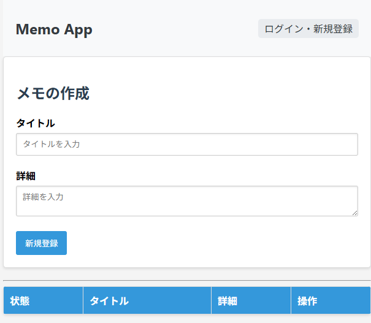
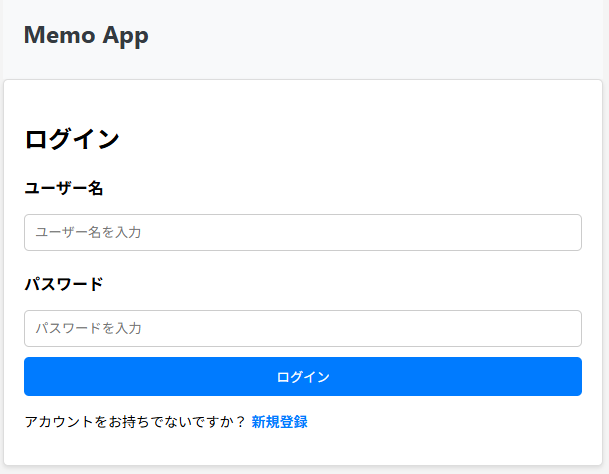
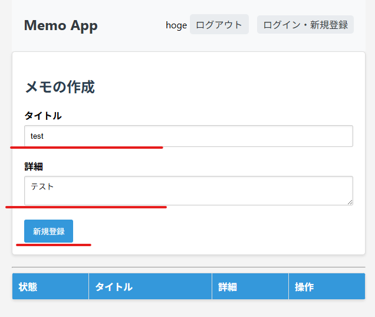
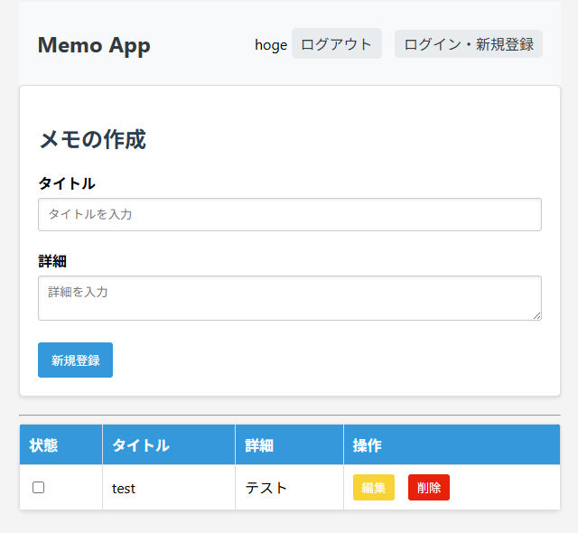
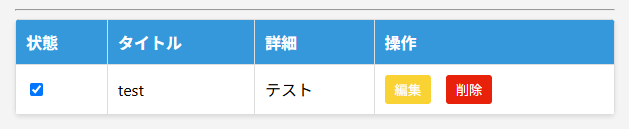

## 説明

FastAPIToDo アプリ試作

## コマンド

カレントディレクトリを実行対象のソース直下にする。

## バックエンド実行

uvicorn main:app --reload

## フロントエンド実行

vscode の LiveServer  
memo>index.html で実行

## DB 初期化

初回起動前には init_datebase.py を実行し、DB 初期化が必要

## python のバージョン

3.13.1  
ライブラリは requirements.txt を参照

## 画面説明

### メイン画面

  
ログイン前の状態です。
ログインしていない間は登録された ToDo は表示されません。  
右上のボタンからログイン画面に遷移します。

### ログイン画面

  
ログインするための画面です。

### メイン画面(新規作成)

ToDo を新規作成する方法です。  
図中赤線のようにタイトル(必須), 詳細(無くても可)を記入した後、「新規登録」ボタンを押下します。

### メイン画面(登録有り)

  
ToDo の登録がある場合は図のように表示されます。

### チェックボックスについて

  
ToDo 左端のチェックボックスはクリックによりチェック状態が切り替わります。  
切り替わる度に状態は保存されます。
